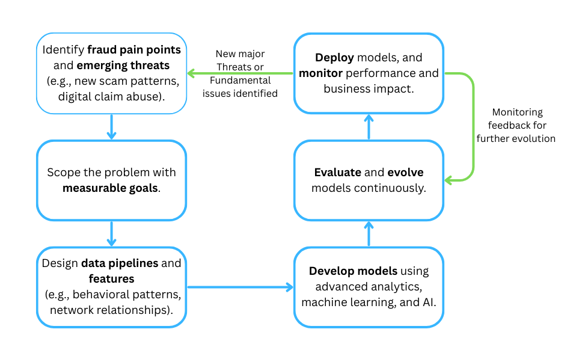

# Strategic Planning for Fraud Detection Innovation

Author: Huan He		Date: 2025/05/26

## Context

- **Role:** Data Scientist

- **Team:** Enterprise Fraud Analytics & Intelligence

- **Team Status:** In the early stages of building a strong, scalable *fraud detection function*.

- **Vision:** Reimagine fraud detection across the insurance lifecycle.

- **Methods:** Leverage advanced analytics, machine learning, and AI.

- **Priorities:** *Accurate, fast, efficient* fraud detection model, ensure collaboration with investigative, underwriting, and claims teams.

  

## Strategic Planning

### 1. Strategic Approach

#### 1.1  Understanding the Current State of Fraud Analytics at the Company

- **Understand the Business Context**

  > "Fraud is defined as any dishonest act or omission intended to deprive or mislead others for personal or corporate gain. Fraud includes criminal deception, the use of false representations to gain unjust advantage, and dishonest schemes or tricks. Examples of fraud include **misappropriating customers’ funds, submitting dishonest claims, misrepresenting customer details on an application, and identity theft.** "  -- Definity THE CODE OF BUSINESS CONDUCT

  - Meet with *Key Stakeholders*. Understand their pain points, expectations from fraud analytics, and operational constraints.
  - Learn *Products* and *Fraud Types* across the lifecycle. 

- **Review Existing Processes and Tools**
  - Current fraud detection *workflows*.
  - Data *entry and management* procedures. Data storage, governance, retention schedules, sharing, etc.
  - Inter-departmental *communication protocols* for fraud alerts and feedback.

- **Assess Avaiable Data**
  - **Data Sources:** claims data, policy data, customer profiles, payment history, internal investigation reports, etc.
  - **Data Availability and Quality:** missing, duplicate, or inaccurate data, time interval, etc.
  - **Labeling Strategy**.

- **Evaluate Existing Models**
  - **Model Types**: supervised, unsupervised, or hybrid.
  - **Explainability and Interpretability**: accuracy, trustworthy, insights.

- **Identify Gaps and Opportunities**
  - **Scalability**: scalable systems across different business lines.
  - **Detection Performance**: accuracy, speed, and efficiency.
  - **Automation Potential**: label, review, report, etc.

#### 1.2 **Methodology for Innovation in Fraud Detection**

#### 1.3 **Balancing Exploration (R&D) with Execution (Impact Delivery)**

|             | Explorations (R&D)                                           | Execution (Impact Delivery)                                  |
| ----------- | ------------------------------------------------------------ | ------------------------------------------------------------ |
| **Goals**   | Investigate new techniques, technologies, and fraud patterns (long-term). | Deliver measurable, business-aligned outcomes (short-term).  |
| **Cycle**   | Monthly or quarterly planning                                | Daily or Weekly planning                                     |
| **Methods** | Explore cutting-edge AI/ML approaches (e.g., GenAI, advanced NLP applications). | Implement well-understood ML techniques, optimize existing rules, improve integration with operations, etc. |
| **Effort**  | 20% ~ 30%                                                    | 70% ~ 80%                                                    |

- Create clear handoff *from R&D to Execution* (e.g. define graduation criteria).
- As stage moves on, more effort can be put on Explorations.

### 2. 60-120-180 Day Plan

#### 2.1 First 60 Days – Learning and Landscape Assessment

- **Goals**
  - Comprehensive understanding of the current fraud landscape.
  - Build relationships and trust.
  - Pinpoint initial opportunities for high-impact, low-effort contributions.

- **Access Requirements (Data, Tools, People, Processes)**
  - **Data:** claims, policy, underwriting, customer, and investigation datasets, historical confirmed fraud cases and investigation notes, records of existing fraud flags or suspicion scores, and any third-party data feeds currently integrated.
  - **Tools:** existing analytics platforms, database systems (e.g., SQL, NoSQL), preferred programming environments (e.g., Python, R), data visualization tools (e.g., Tableau, PowerBI), and version control systems/code repositories.
  - **People:** Enterprise Fraud Analytics & Intelligence, investigative, underwriting, claims teams, IT and Legal/Compliance teams.
  - **Processes:** documentation related to current fraud detection workflows, the claims processing lifecycle, underwriting guidelines, investigation protocols, and existing data governance procedures.

- **Questions to Address**
  - What are the most prevalent, costly, and challenging types of insurance fraud currently affecting the company?
  - From the perspective of investigative, claims, and underwriting teams, what are the most significant *pain points* and bottlenecks in the current fraud detection process and information flow?
  - How is the success of fraud detection efforts currently measured? What are the *baseline metrics* for accuracy, speed of detection, operational efficiency, and false positive rates?
  - What are the perceived organizational or technical barriers to adopting more advanced analytical techniques or AI/ML solutions for fraud detection?

- **Quick Wins to Seek**
  - *Automate* currently manual, repetitive data extraction or reporting tasks to free up analyst time.
  - Conduct an analysis of historical confirmed fraudulent claims to *identify common characteristics* or red flags that can be used to refine existing detection rules or heuristics.
  - Develop interactive dashboards.

#### 2.2 Next 60 Days (Days 61–120) – Experimentation and Value Validation

- **Goals**
  - Test initial hypotheses for advanced fraud detection techniques.
  - Quantify business value and validate with stakeholders.
  - Show how ML/AI can enhance current processes.

- **Hypotheses to Explore**
  - We can increase fraud detection accuracy using a supervised ML model trained on historical confirmed fraud cases.
  - Unstructured data (e.g., claim notes, adjuster comments) holds untapped signals for fraud detection.
  - Certain rules are triggering too frequently and overwhelming investigators with false positives.

- **Success Metrics**
  - **Model Performance:** Key metrics including Precision, Recall, F1-Score, and Area Under the ROC Curve (AUC-ROC), with particular attention to performance on the minority (fraud) class, given the typically imbalanced nature of fraud data.
  - **Operational Impact:** Quantifiable measures such as the reduction in false positives (thereby saving investigator time), an increase in the true positive detection rate, a decrease in the average time taken to detect fraud, and estimated cost savings from prevented fraudulent payouts.
  - **Stakeholder Feedback:** Qualitative input from investigators and claims adjusters regarding the utility, actionability, and interpretability of the outputs.

- **Cross-Organizational Collaboration**
  - **Investigative team** (to validate results and get real-world feedback).
  - **Underwriting team** (to improve upfront risk assessment processes).
  - **Claims team** (to ensure integration into triage workflows).
  - **IT team** (to help with pipelines).
  - **Legal/Compliance** (if sensitive features like demographic data are involved).

#### 2.3 Final 60 Days (Days 121–180) – Scaling and Strategic Positioning

- **Goals**
  - Operationalize successful solutions.
  - Strengthen feedback loops.
  - Position Data Scientist as a key long-term contributor.

- **Scaling Learnings or Models**
  - **Deploy validated model into production**. Outline infrastructure requirements, integration points with existing systems, etc.
  - **Automate data pipelines**. Design and implement real-time, automated data pipelines for data ingestion, preprocessing, feature engineering and model scoring.
  - Build a **feedback loop** to capture case outcomes and retrain models.
  - Create **thorough documentation** for all developed models, associated codebases, and operational processes. 

- **Strategic Contributions**
  - Mature fraud detection models with a proven return on investment.
  - Automated reporting dashboards that provide actionable insights to business users.
  - Refined alert generation systems that integrate smoothly into investigative workflows.

- **Long-Term Embedding**
  - Cultivate deep expertise in *specific fraud domains* and advanced analytical methodologies relevant to these areas.
  - Regularly scan the external environment for *emerging technologies*, *novel data sources*, and *innovative methodologies* applicable to fraud detection. 
  - Actively *share knowledge*, mentor junior team members, and foster a highly *collaborative* team environment.
  - Consistently ensure that all analytical work and proposed initiatives are clearly *linked to the business objectives* of the fraud team and the broader strategic goals of the company.
  - Design and implement *robust feedback loops*, particularly from model end-users (e.g., investigators), to continuously refine, retrain, and enhance the performance of fraud detection capabilities.

### 3. Technology, Tools, and Technique

#### 3.1 **Modern AI/ML Techniques for Fraud Detection**

- **Supervised Learning**
  - **Techniques:** Gradient Boosting Machines (e.g., XGBoost, LightGBM), Random Forests, Logistic Regression.
  - **Rationale:** These techniques are highly effective for classification tasks when sufficient labeled historical fraud data is available. Gradient boosting methods, in particular, often achieve state-of-the-art performance in fraud detection applications due to their ability to focus on hard-to-classify instances. 

- **Unsupervised Learning**
  - **Techniques:** Isolation Forests, One-Class Support Vector Machines (SVM), Clustering algorithms (e.g., K-Means, DBSCAN).
  - **Rationale:** Essential for identifying novel or unusual patterns that do not conform to known fraud signatures. This is particularly valuable when labeled fraud data is scarce, when dealing with emerging fraud typologies, or for detecting outliers in provider billing behavior.

- **Natural Language Processing (NLP)**
  - **Techniques:** Hugging Face Transformers, LLMs (GPT-4 Turbo in retrieval mode).
  - **Rationale:** A significant amount of crucial information in insurance is locked in unstructured text data such as claims notes, adjuster reports, witness statements, customer emails, and even social media posts. NLP unlocks these insights, often revealing nuanced indicators of potential fraud that structured data alone cannot capture.

#### 3.2 Structured vs. Unstructured Data

- **Structured Data**

  Form the foundational layer for most initial fraud models and rule-based detection systems. It is directly consumable by many machine learning algorithms and is used for predictive modeling, developing rules engines, anomaly detection on transactional data, etc.

- **Unstructured Data**

  Unstructured data often harbors rich contextual information and subtle indicators of fraud that are not captured in structured fields. Effectively leveraging this data is a key component of "reimagining" fraud detection and can provide a significant uplift in detection accuracy and the ability to uncover more complex fraud schemes.

#### 3.3 Building a Fraud Model/Scoring System from Scratch

- Problem Definition and Goal Setting
- Data Collection and Preparation
- Exploratory Data Analysis (EDA)
- Feature Engineering
- Model Selection
- Model Training and Validation
- Thresholding and Scoring
- Interpretability and Explainability
- Deployment and Monitoring
- Feedback Loop and Iteration

### 4. Innovation Suggestion

**Network Analysis** is a method used to study the relationships and interactions between entities (nodes) connected by links (edges). These entities can be people, organizations, accounts, devices, etc., and the connections between them represent interactions like communications, transactions, or shared attributes.

- **Why Network Analysis?**
  - **Increased Accuracy**. Network analysis excels at identifying *collusion rings* and sophisticated fraud schemes.
  - **Improved Speed of Detection**. Once a suspicious entity (e.g., a fraudulent claimant or a collusive repair shop) is identified, network analysis can rapidly *highlight all associated entities and claims*.
  - **Enhanced Operational Efficiency.** Instead of investigators manually trying to piece together disparate data points from various systems, a graph database provides a unified, visual representation of complex relationships.

- **How it works?**

  A policyholder claims an accident involving a repair shop and a medical clinic. Network analysis shows:

  - The same repair shop is involved in 40% of suspicious claims.
  - The same doctor signs off on most of them.
  - All claimants are connected via a social network.

  This clustered activity would raise a red flag for further investigation.

## Conclusions

- **Vision** 

  Reimagine fraud detection using advanced analytics, ML, and AI for accuracy, speed, and efficiency.

- **Strategy**

  - Begin with a deep understanding of the current fraud landscape, processes, data, and stakeholder needs.
  - Follow a 60-120-180 day plan for assessment, experimentation, value validation, and scaling solutions.
  - Combine exploration of cutting-edge AI/ML with the execution of proven techniques for immediate and long-term impact.

- **Technology**
  - Leverage supervised, unsupervised learning, and NLP.
  - Utilize both structured and unstructured data for comprehensive insights.

- **Innovation**

​	Network Analysis uncovers hidden relationships and collusion rings.

- **Foundation for Success**
  - Build robust fraud models through careful data handling, feature engineering, validation, and continuous feedback.
  - Success depends on continuous learning, iteration, strong cross-functional collaboration, and a focus on measurable business outcomes.

**References**

[1] Definity Code of Business. https://s28.q4cdn.com/441925426/files/doc_downloads/DocumentsAndPolicies/Policies/DI-2022-Code-of-Conduct-EN_final_AODA.pdf

[2] Machine learning for insurance fraud detection: A complete guide | Langate. https://langate.com/news-and-blog/insurance-fraud-detection-using-machine-learning/

[3] Issue Brief - Insurance Fraud - American Academy of Actuaries. https://actuary.org/wp-content/uploads/2024/10/casualty-brief-insurance-fraud.pdf

[4] Using AI to fight insurance fraud | Deloitte Insights. https://www2.deloitte.com/us/en/insights/industry/financial-services/financial-services-industry-predictions/2025/ai-to-fight-insurance-fraud.html

[5] Role of NLP in Insurance Fraud Detection and Prevention - TestingXperts. https://www.testingxperts.com/blog/nlp-in-insurance-fraud-detection-and-prevention/

[6] Handling Imbalanced Data in Insurance Fraud Detection: A Machine Learning Approach. https://www.researchgate.net/publication/389264252_Handling_Imbalanced_Data_in_Insurance_Fraud_Detection_A_Machine_Learning_Approach

[7] Predictive Analytics: The Future of Insurance Fraud Detection | Inaza. https://www.inaza.com/blog/predictive-analytics-the-future-of-insurance-fraud-detection
